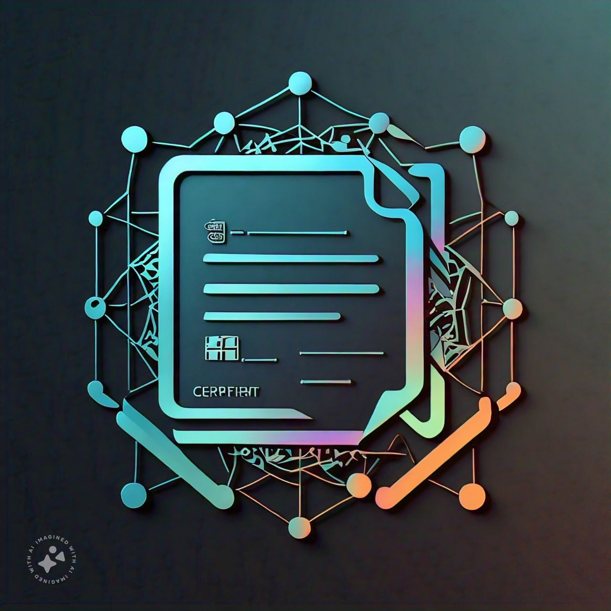

# Decentralized Education Certificate Issuance



## Vision

The **Decentralized Education Certificate Issuance** contract aims to revolutionize the way educational certificates are issued and verified. By leveraging blockchain technology, this contract provides a secure, transparent, and immutable system for managing certificates. It ensures that once issued, certificates are permanent and tamper-proof, reducing fraud and administrative overhead for educational institutions.

## Flowchart

```plaintext
+--------------------+          +------------------+         +-----------------+
|    Deploy Contract | -------> | Issue Certificate | ------> |   Certificate   |
|                    |          |                  |         |    Issued       |
+--------------------+          +------------------+         +-----------------+
                                              |
                                              |
                                              v
                                  +---------------------+
                                  |   Verify Certificate |
                                  |     (Public Query)  |
                                  +---------------------+
                                              |
                                              |
                                              v
+--------------------+          +------------------+         +------------------+
| Revoke Certificate | -------> |   Certificate    | ------> |  Certificate     |
|                    |          |   Revoked        |         |   Status Updated |
+--------------------+          +------------------+         +------------------+
```

## Contract Address

- **Contract Address** 0x6A8A0375B781627Cf3D7c5DB02576771648263A4


## Features

- **Issue Certificate:** Allows the contract owner to issue a certificate to a student.
- **Revoke Certificate:** Enables the owner to revoke a certificate if necessary.
- **Verify Certificate:** Allows public verification of certificate validity and details.
- **Get Certificate:** Provides detailed information about a certificate.

## Future Scope

1. **Integration with NFTs:** Incorporate Soulbound NFTs to represent certificates in a non-transferable format.
2. **Access Control:** Enhance access control by allowing multiple institutions or organizations to manage certificates.
3. **Enhanced Security:** Implement additional security features such as multi-signature controls for issuing and revoking certificates.
4. **User Interface:** Develop a user-friendly web or mobile application for easier interaction with the smart contract.

## Contact Details

For any inquiries, support, or contributions, please contact:

- **Name:** Sujoy Kumar Das
- **Email:** sunildas12385@gmail.com
- **GitHub:** https://github.com/Techno-Strange

Thank you for your interest in the Decentralized Education Certificate Issuance project! Your feedback and contributions are highly valued.
